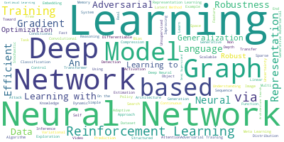
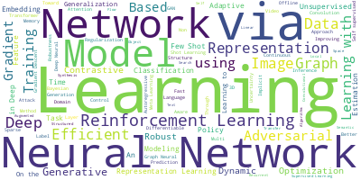
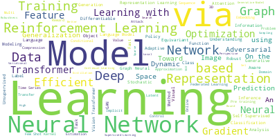
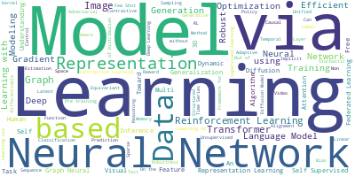
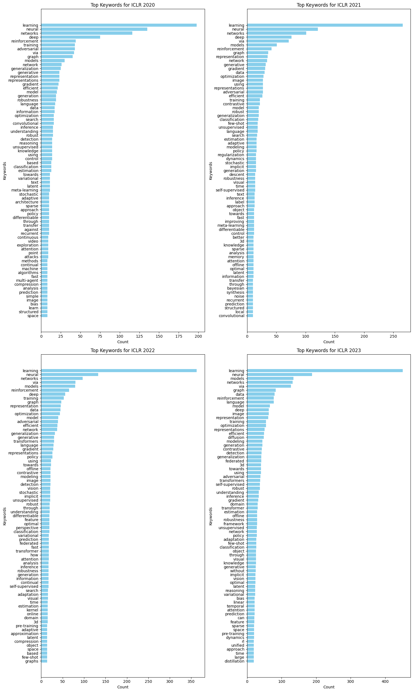
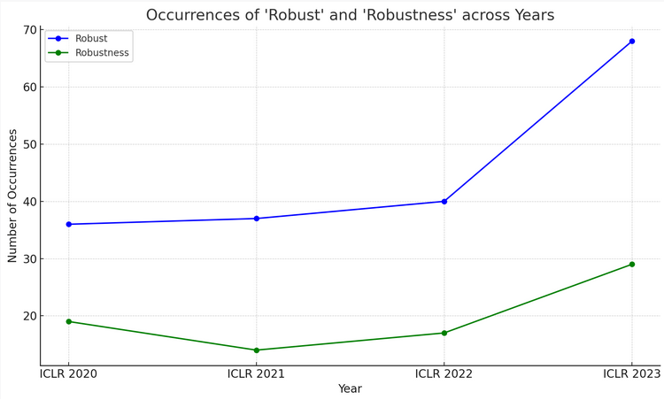

# iclr2024
Supporting material for ICLR 2024 submission

## Paper title keyword occurence

Examined 4 URLS:
```
https://iclr.cc/virtual/2020/papers.html?filter=titles&search=
https://iclr.cc/virtual/2021/papers.html?filter=titles&search=
https://iclr.cc/virtual/2022/papers.html?filter=titles&search=
https://iclr.cc/virtual/2023/papers.html?filter=titles&search=

```

Generated 4 word clouds and 4 latex formatted tables with counts

```
$  $ python iclr_counts.py
Enter the filename (e.g., iclr2023.txt): iclr2020.txt
Word cloud saved to: iclr2020_wordcloud.png
LaTeX table saved to: iclr2020_counts.tex

```

Outputs saved to images, tables. Inputs saved in data.

## Word Clouds

**ICLR 2020** 



**ICLR 2021** 



**ICLR 2022** 



**ICLR 2023** 



## Keyword Bar Charts



## Keywords of interest Line Chart


